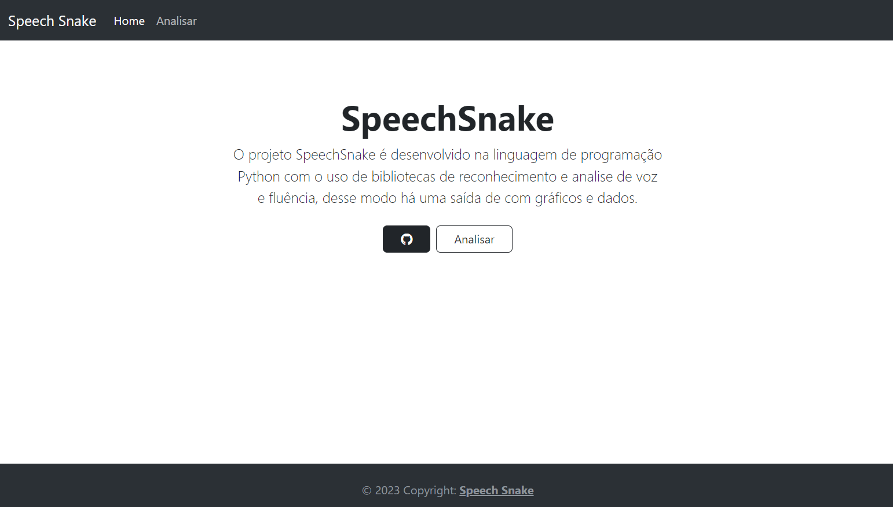
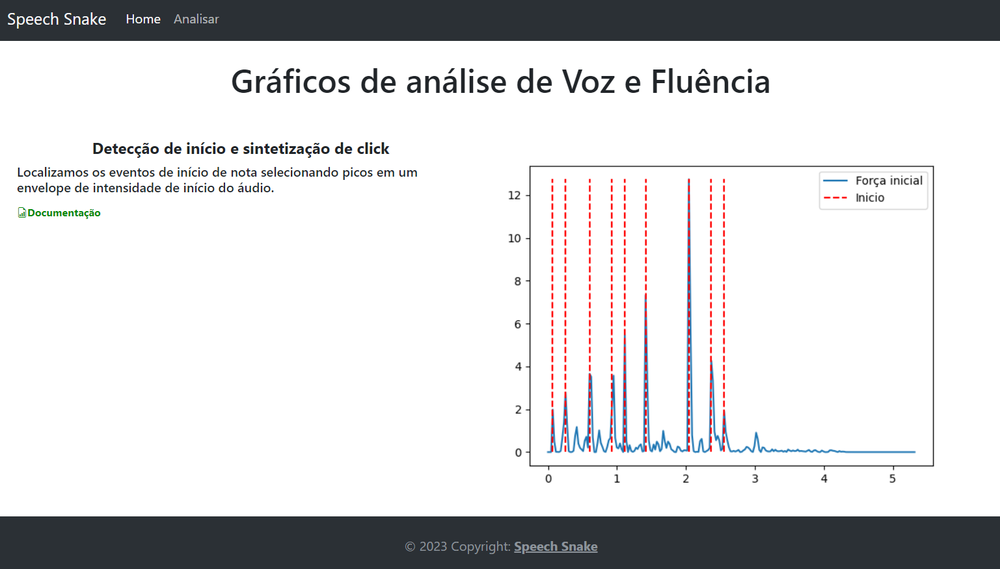

# SpeechSnake

O projeto SpeechSnake é desenvolvido utilizando Python, assim originando seu nome, e com o uso de bibliotecas de análise de voz e fluência, desse modo há uma saída de com gráficos e dados sobre o áudio em questão.

</br>

# 🚀 Começando

Instale as dependências disponibilizadas no package(requirements.txt), entre no ambiente virtual e então execute:

windows:

```
  pip install -r requirements.txt
  venv/Script/activate
  flask run
```

# 📋 Pré-requisitos

Para executar o projeto em seu ambiente será necessário a utilização da versão do python >=3.7, <3.11.

# 📃 Páginas



# 🛠️ Construído com

- [Flask](https://flask.palletsprojects.com/) - Framework web
- [Boostrap](https://getbootstrap.com/) - Framework web styles
- [Librosa](https://librosa.org/doc/latest/index.html) - Biblioteca de análise de áudios
- [Matplotlib](https://matplotlib.org/) - Biblioteca de visualização gráfica

# ✒️ Autores

📚 Perfis profissionais:

- **Cientista/Desenvolvedor** - [Luzia Silva](https://github.com/Luzia-Silva)
- **Cientista/Desenvolvedor** - [Joyce Leal](https://www.linkedin.com/in/joyce-lebedasi/)
- **Cientista/Desenvolvedor** - [Vinicius Augusto](https://www.linkedin.com/in/vinissilva/)
