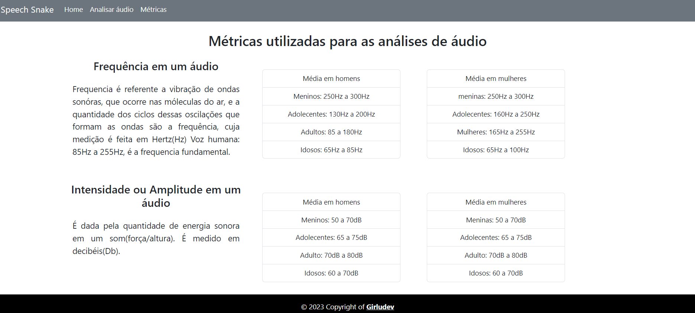
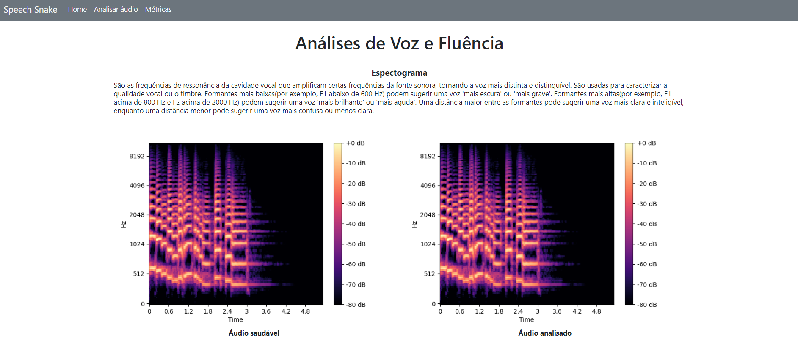
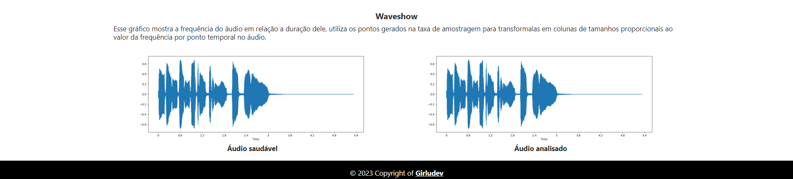

<center>

</center>

### O projeto SpeechSnake foi desenvolvido com a utilização da linguagem Python, que deu origem ao seu nome, e também bibliotecas de análise de voz e fluência que resultam em uma saída com gráficos e dados sobre o áudio analisado.

</br>

# 🚀 Começando

Instale as dependências disponibilizadas no package(requirements.txt), entre no ambiente virtual e então execute:

windows:

```
  pip install -r requirements.txt
  venv/Script/activate
  flask run
```

# 📋 Pré-requisitos

Para executar o projeto em seu ambiente será necessário a utilização da versão do python >=3.7, <3.11.

# 📃 Páginas






# 🛠️ Construído com

- [Flask](https://flask.palletsprojects.com/) - Framework web - versão 2.2.3
- [Bootstrap](https://getbootstrap.com/) - Framework web styles - versão 5.0
- [Librosa](https://librosa.org/doc/latest/index.html) - Biblioteca de análise de áudios - versão 0.10.0
- [Matplotlib](https://matplotlib.org/) - Biblioteca de visualização gráfica - versão 3.7.1

# ✒️ Lista de Atividades

- Criação das telas - ✅
- Upload de áudio - em andamento
- Treinamento de algoritmo para criar comparativos - em andamento
- Criação da documentação do projeto - em andamento

# ✒️ Autores

📚 Perfis profissionais:

- **Desenvolvedor** - [Luzia Silva](https://github.com/Luzia-Silva)
- **Pesquisador** - [Joyce Leal](https://www.linkedin.com/in/joyce-lebedasi/)
- **Pesquisador/Desenvolvedor** - [Vinicius Augusto](https://www.linkedin.com/in/vinissilva/)

<br>
<br>
 <Center>
      <p>Copyright © 2023 Girludev ❤️</p>
    
 </Center>
