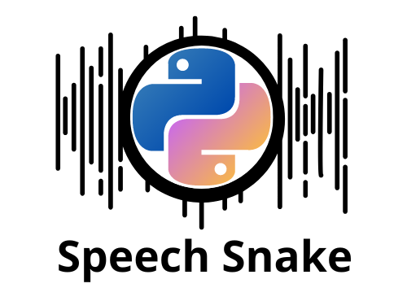
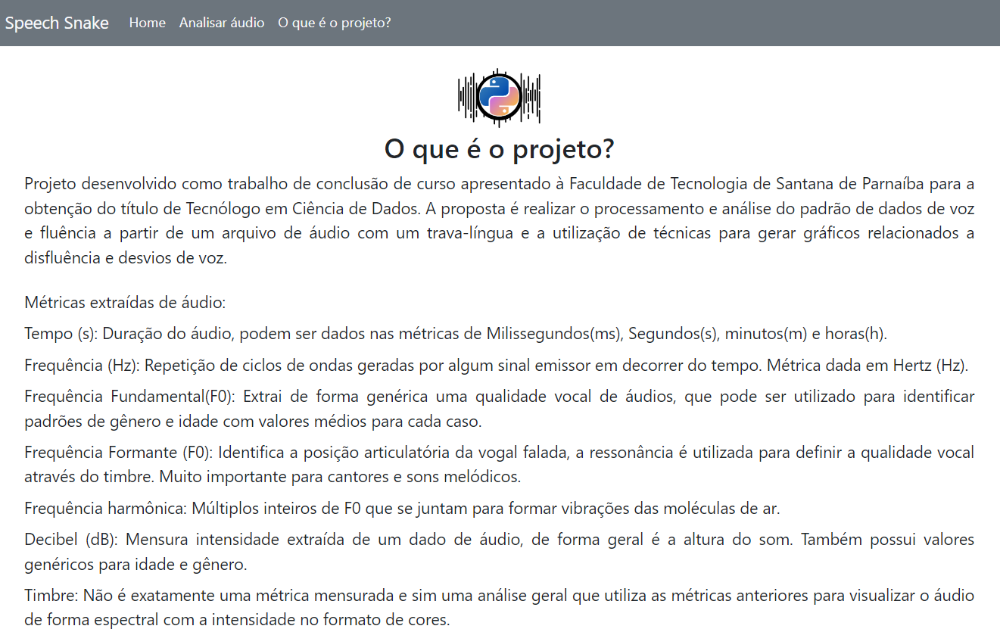
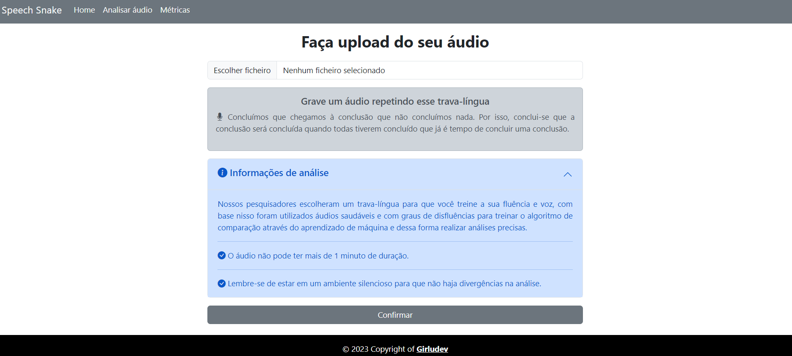
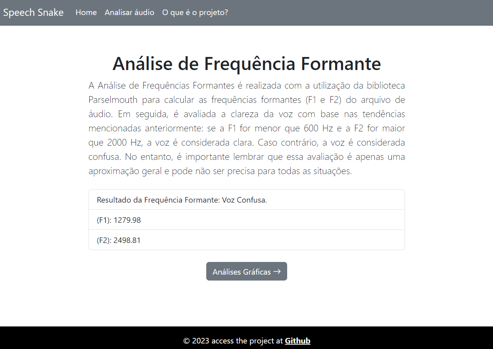
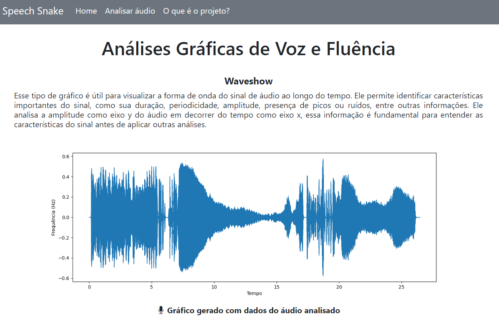
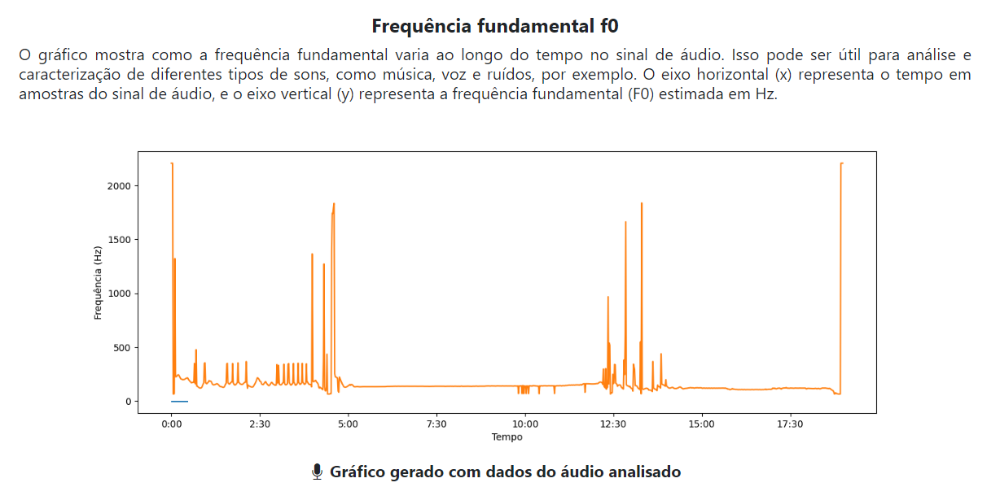
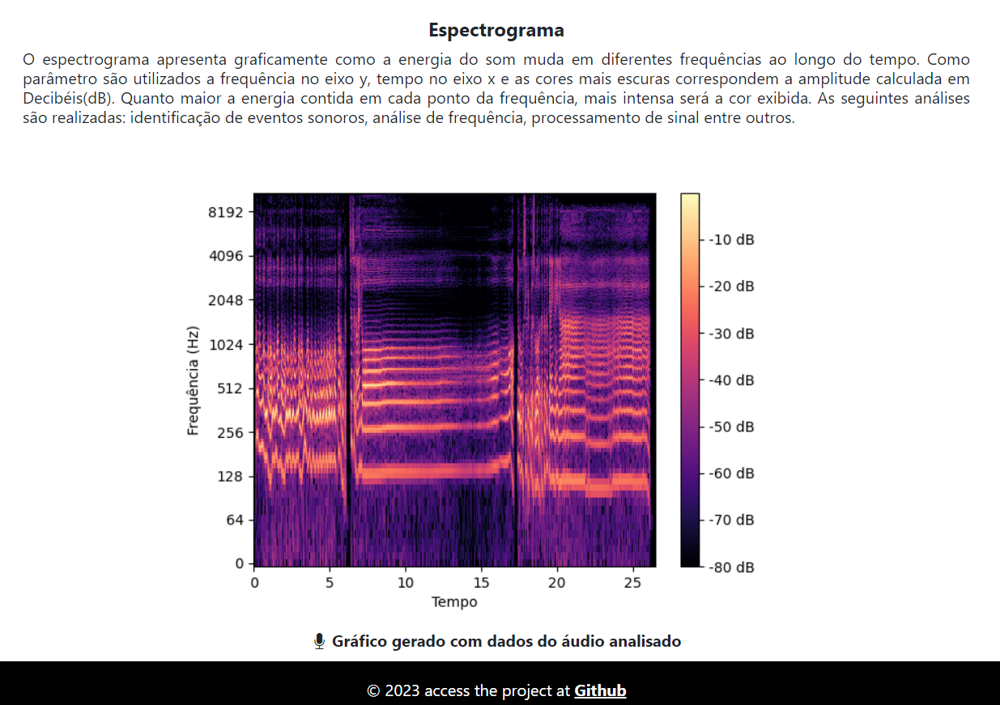

<center>

</center>

### O projeto SpeechSnake foi desenvolvido com a utilização da linguagem Python, que deu origem ao seu nome, e também bibliotecas de análise de voz e fluência que resultam em uma saída com gráficos e dados sobre o áudio analisado. 
### Documentação do projeto: [TG_SpeechSnake](docs/TG_FatecSDP.pdf)
</br>

# 🚀 Começando

Instale as dependências disponibilizadas no requirements.txt dentro do seu ambiente virtual, então siga todos os passos abaixo:

Windows:

```
  python -m venv venv
  source venv/Scripts/activate
  pip install -r requirements.txt
  flask run

```

Linux:

```
  python -m venv venv
  source venv/bin/activate
  pip install -r requirements.txt
  flask run

```

# 📋 Pré-requisitos

Para executar o projeto em seu ambiente será necessário a utilização da versão do python >=3.7, <3.11.

# 📃 Páginas










# 🛠️ Construído com

- [Flask](https://flask.palletsprojects.com/) - Frame work web - versão 2.2.3
- [Bootstrap](https://getbootstrap.com/) - Framework web styles - versão 5.0
- [Librosa](https://librosa.org/doc/latest/index.html) - Biblioteca de análise de áudios - versão 0.10.0
- [Matplotlib](https://matplotlib.org/) - Biblioteca de visualização gráfica - versão 3.7.1
- [Parselmouth](https://parselmouth.readthedocs.io/en/stable/) - Biblioteca Python para o software Praat
- [BackBlaze](https://www.backblaze.com/) - Upload de arquivos na nuvem
- [b2-sdk-python](https://b2-sdk-python.readthedocs.io/en/master/quick_start.html#copy-file) - É uma biblioteca cliente para fácil acesso a todos os recursos do B2 Cloud Storage.


<br>
<br>
<h1 align="center">Development Team</h1>
<p align="center">
<a href="https://www.linkedin.com/in/silva-luzia/"></a>&nbsp;&nbsp;<a href="https://www.linkedin.com/in/joyce-lebedasi/"></a>&nbsp;&nbsp;<a href="https://www.linkedin.com/in/vinissilva/"></a>
</p>

<br>
 <Center>
      <p>Copyright © 2023 Girludev Company ❤️</p>
    
 </Center>
